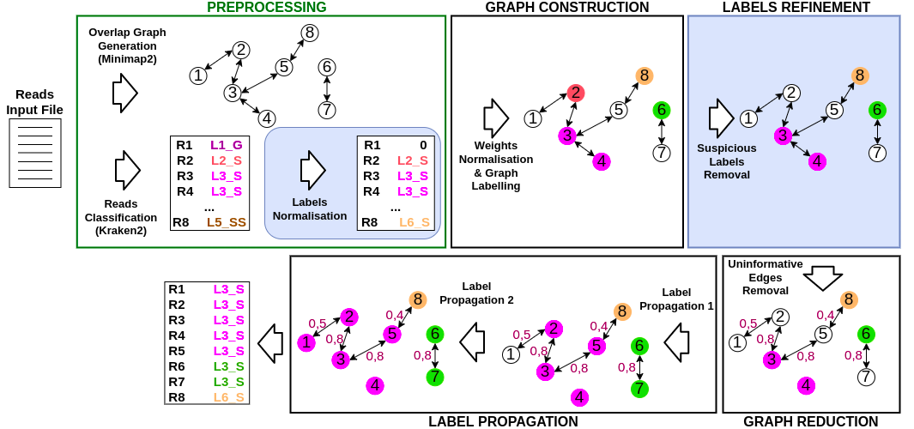

# ClassGraph2
Current sequencing technologies allow the study of microbial communities grabbed directly from the natural environment. Taxonomical annotation of the reads is one the main steps in the typical metagenomic analysis pipeline. Most of the methods currently available focus on the classification of reads using a set of reference genomes and their k-mers. These methods often perform poorly in terms of sensitivity. The tool ClassGraph was proposed to overcome this issue by propagating taxonomic labels over a reads overlap graph. ClassGraph2 optimizes its predecessor from different perspectives. Thanks to a refine label technique, it is able to detect and correct wrong taxonomic labels, thus improving the classification also in terms of precision. Besides, by focusing on the code efficiency, we were able to significantly reduce time and memory requirements with respect to ClassGraph. ClassGraph2 proved to be effective in enhancing the classification of both the state of the art taxonomic binning tool Kraken2 and its predecessor ClassGraph.

<p align="center">
  
</p>

## ClassGraph2 Download
It's possible to download ClassGraph2 by cloning the repository in your machine.

```
git clone https://github.com/MargheritaCavattoni/ClassGraph2.git
```
## Installation
The istallation of ClassGraph2 requires python 3.7 or above. Besides the following dependency is needed:
* [python-igraph](https://igraph.org/python/)

### Setting the environment with Conda
It's possible to use [Conda](https://docs.conda.io/en/latest/) in order to set-up the proper environment of ClassGraph2. [Anaconda](https://www.anaconda.com/distribution/) or [Miniconda](https://docs.conda.io/en/latest/miniconda.html) contain Conda.

In order to create the Conda environment and activate it run the following commands:
```
conda env create -f environment.yml
conda activate ClassGraph2
```

## Preprocessing
ClassGraph2 requires two input files: one representing a graph of reads and the other containing the result of the classification process. The labelles assigned to the reads by the pre-existing binning tool will be propagated over the graph to the still unclassified reads. ClassGraph2 is thought to be used with both paired-end and single-end reads. It can be used for short and for long reads.

### Overlap Graph
The graph must be composed as follows: the nodes represent the reads and the weights of the edges their overlaps. The file must be presented in asqg format.
One possible tool that satisfies these requirements is [**SGA**](https://github.com/jts/sga) (String Graph Assembler), an assembler based on the overlap-layout-consensus. For long reads it's possible to utilize [**minimap2**](https://github.com/lh3/minimap2).
If you are using an assembler that does not use exact overlaps to build the graph, you can modify the asqg format by adding a final column containing the values of the weights you want to assign to the edges (in this case set the option --assembler 2). 

### Binning Tools
ClassGraph2 requires as input the result of the classification process presented as follows:
```
NODE.1  L1
NODE.2  L1
NODE.3  L1
NODE.4  L2
NODE.5  L2
...
```
Where NODE_i is the node ID and Li represents its label. Li must be equal to 0 if the read wasn't classified.
Hypothetically any metagenomic binning tool could be used for the classification. 

## Usage Example
In order to run ClassGraph2 it's necessary to type on the terminal a command structured as follows:
```
python3 ClassGraph2.py --graph $Assembler_DIR/Graph.asqg --output $ClassGraph2_Output_DIR/ --binned $Classifier_DIR/BinnedReads.out --prefix example1 --max_iteration 20 --read_type 1 --assembler 1
```
Where:
```
--graph           path to the graph file (asqg)
--output          path to the folder where we want to store the output
--binned          path to the file that stores the result of the initial classification with a preexisting binning tool
--prefix          name of the output file
--max_iteration   maximum number of iterations in the label propagation algorithm (default: 20)
--read_type       1 for paired-end (default), 2 for single-end reads
--assembler       1 for asqg format (default), 2 in the case of modified asqg
```
## Getting help
If you encounter bugs or have further questions or requests, you can raise an issue at the issue page. You can also contact Margherita Cavattoni at cavattonimargherita@gmail.com

## Citation
M. Cavattoni, M. Comin,
*"Improved Metagenomic Reads Classification with ClassGraph2"*,
under submission.
